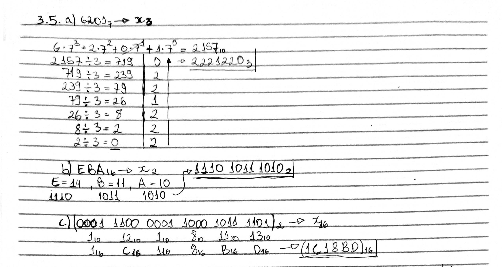
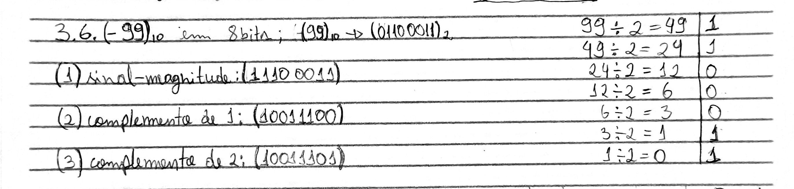
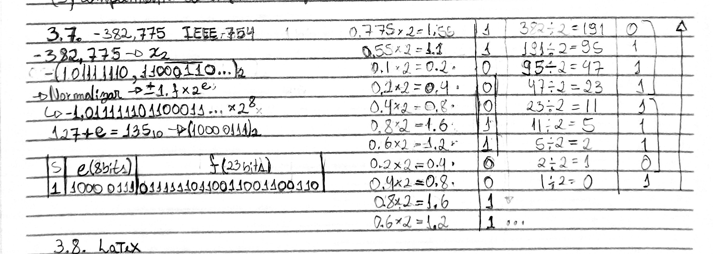
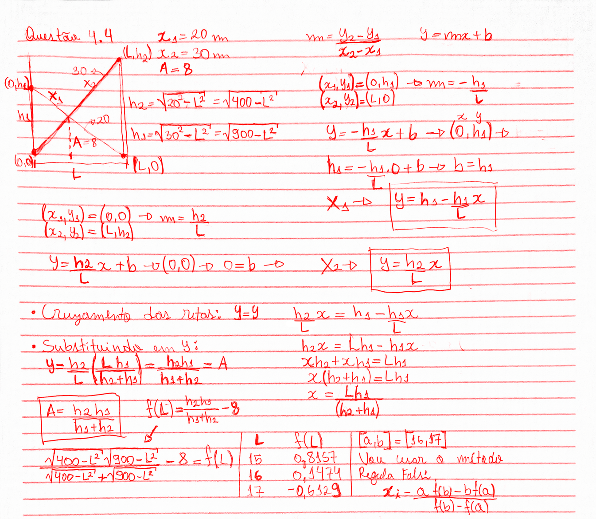

------------------------------------------------------------------------

\newpage

## Questão 2.2

Uma operação bastante comum em processamento de sinais é a convolução.

a)  Crie uma função $f(x) = \sin(x) + \eta(x)$ onde $\eta(x)$ é uma função de ruído branco gaussiano. Utilize `np.random.normal` com média 0 e desvio padrão pequeno, por exemplo, 0.1.

b)  Calcule a convolução de $f(x)$ com um filtro de média. Utilize a função `np.convolve`. O primeiro argumento
dessa função é o vetor no qual quer aplicar a convolução. O segundo argumento é o chamado kernel. Escolha
`np.ones(s)/s`. Quanto maior o valor de s, maior será a suavização.

c)  Plote em uma única figura:

-   a função $\sin(x)$;
-   a função $f(x)$;
-   o resultado da convolução;
-   o erro absoluto entre o resultado da convolução e $\sin(x)$.

### Resposta

```{python}
import numpy as np
import matplotlib.pyplot as plt

x = np.linspace(0, 10, 1000)
seno = np.sin(x)
ruido = np.random.normal(0, 0.1, len(x))
f = seno + ruido

s = 25
kernel = np.ones(s) / s
conv = np.convolve(f, kernel, mode='same')
erro = np.abs(conv - seno)

plt.figure(figsize=(10, 6))
plt.plot(x, seno, label="sen(x)")
plt.plot(x, f, label="f(x) = sen(x) + ruído", alpha=0.7)
plt.plot(x, conv, label="Convolução")
plt.plot(x, erro, label="Erro absoluto")
plt.grid(True)
plt.legend()
plt.show()
```

------------------------------------------------------------------------

\newpage

## Questão 2.4 py

Em algumas aplicações, uma função não é conhecida, mas sua derivada e algum ponto da função são conhecidos.

Dados:

-   $f(x)=x\cos(x)+1$ (apenas para comparação),
-   $f(0)=1$,
-   $f'(x)=\cos(x)-x\sin(x)$.

Partindo de $f(0)$, estime outros pontos de $f(x)$ no intervalo $[0,6]$ pelo método de Euler.\
Plote em um único gráfico:

-   a função $f(x)$, - os pontos estimados, conectando-os com segmentos de reta.

### Resposta

```{python}
import numpy as np
import matplotlib.pyplot as plt

def f(x):
    return x * np.cos(x) + 1

def df(x):
    return np.cos(x) - x * np.sin(x)

h = 0.5
x_aprox = np.arange(0, 6 + h, h)
y_aprox = np.zeros(len(x_aprox))
y_aprox[0] = 1

for i in range(len(x_aprox) - 1):
    y_aprox[i+1] = y_aprox[i] + h * df(x_aprox[i])

x = np.linspace(0, 6, 400)

plt.plot(x, f(x), label="f(x) real")
plt.plot(x_aprox, y_aprox, 'o-', label="Euler")
plt.grid(True)
plt.legend()
plt.show()
```

------------------------------------------------------------------------

\newpage

## Questão 3.5

Realize as seguintes conversões de base:

a.  $6201_7 \to x_3$\
b.  $EBA_{16} \to x_2$\
c.  $111000001100010111101_2 \to x_{16}$

### Resposta

{fig-align="center" width="100%"}

------------------------------------------------------------------------

\newpage

## Questão 3.6

Represente o número -99 em inteiro de 8 bits utilizando (1) sinal-magnitude, (2) complemento de 1 e (3) complemento de 2.

### Resposta

{fig-align="center" width="100%"}

------------------------------------------------------------------------

\newpage

## Questão 3.7

Represente o número -382.775 de acordo com o padrão IEEE 754 (precisão simples).

### Resposta

{fig-align="center" width="100%"}

------------------------------------------------------------------------

\newpage

## Questão 3.8

Você está escrevendo um programa que registra em um arquivo os comandos de um controle de Playstation. Esse controle possui um total de 14 botões, além do analógico. Mas para os registros, você considerará somente os seguintes 12 botões: $\triangle$, $\times$, $\square$, $\bigcirc$, $\rightarrow$, $\leftarrow$, $\uparrow$,$\downarrow$, `LT`, `LB`, `RT`, `RB`.

a)  Como você poderia representar uma sequência de comandos como inteiros? Exemplifique.

b)  Como você poderia gravar/recuperar uma sequência de comandos de forma a economizar o máximo possível de espaço no arquivo?

### Resposta

`a)` Podemos representar cada comando do controle um inteiro de 12 bits, em que cada bit indica o estado de um dos 12 botões. Se o bit vale `1`, o botão está pressionado, e `0` quando o botão não está pressionado. Associando os botões aos bits de 0 a 11:

$bit\ 0=\triangle$\
$bit\ 1=\times$\
$bit\ 2=\square$\
$bit\ 3=\bigcirc$\
$bit\ 4=\rightarrow$\
$bit\ 5=\leftarrow$\
$bit\ 6=\uparrow$\
$bit\ 7=\downarrow$\
$bit\ 8=\text{LT}$\
$bit\ 9=\text{LB}$\
$bit\ 10=\text{RT}$\
$bit\ 11=\text{RB}$

Podemos representar cada comando na forma de uma soma de potências de 2, onde cada potência corresponde a um botão: $$
Comando=\sum_{i=0}^{11} b_i2^i, \ \ \ \ \ b_i\in\{0,1\}.
$$

Por exemplo, se os botões $\times$, $\uparrow$ e `RT` estiverem pressionados, então os bits 1, 6 e 10 valem `1`. Logo,

$$
Comando = 2^1 + 2^6 + 2^{10} = 2 + 64 + 1024 = 1090.
$$

Que convertendo para binário, obtemos: $$
010001000010_2.
$$

`b)` Para economizar espaço no arquivo, o mais adequado é gravar os comandos em formato binário. Na recuperação, basta ler cada número e verificar quais posições estão marcadas com `1`, descobrindo assim quais botões estavam pressionados.

\newpage

## Questão 4.3

Encontre computacionalmente as 4 raízes reais de:

$$f(x)=x^4 - 2.36343x^3 - 18.1163x^2 + 20.7595x + 58.8273$$

-   Métodos

    a.  Bisseção
    b.  Newton-Raphson
    c.  Secante
    d.  Regula Falsi

-   na resolução, compare os métodos em relação ao número de iterações

-   Implementar utilizando os templates (em C/python/R) disponíveis no github

-   Metodologia:

    1.  Você pode utilizar o gráfico para ter uma boa noção do intervalo inicial no caso de (a), $x_0$ no caso de (b) e $x_0$, $x_1$ no caso de (c) e (d).
    2.  O critério de parada deve ser:
        a.  $|f(x_i)| < 0.001$ (note a mudança em relação é questão anterior)
    3.  Basta que cada método encontre uma das raízes, desde que todas as 4 raízes sejam encontradas
    4.  A função que implementa o método deve escrever todas as aproximações na tela (uma por linha)

### Resposta

-  Gráfico da função

```{r}
#| echo: false
#| message: false
#| warning: false
library(ggplot2)

f <- function(x) {
  58.8273 + 20.7595*x - 18.1163*x^2 - 2.36343*x^3 + x^4
}

df <- data.frame(x = seq(-3.6, 5.2, length.out = 1000))
df$y <- f(df$x)

ggplot(df, aes(x, y)) +
  geom_line(color = "aquamarine3", linewidth = 0.8) +
  geom_hline(yintercept = 0, linetype = "dotdash", linewidth = 0.5, color = "black") +
  scale_x_continuous(breaks = seq(-3.6, 5.2, by = 0.4), limits = c(-3.6, 5.2)) +
  scale_y_continuous(breaks = seq(-60, 80, by = 20), limits = c(-60, 80)) +
  theme(axis.text.x = element_text(size = 5),
        axis.text.y = element_text(size = 5)
)
```

Pelo gráfico da função, utilizei os seguintes valores para cada método:

-   Bisseção: $[a,b] = [-3.5, -3.0]$
-   Newton-Raphson: $x_0=-1.6$
-   Secante: $x_0=2.0$ e $x_1=3.0$
-   Regula Falsi: $[a,b] = [4.5, 5.0]$

Implementação em R

```{r}
f <- function(x) {
  x^4 - 2.36343*x^3 - 18.1163*x^2 + 20.7595*x + 58.8273
}
# derivada da funcao f(x), p/ usar no método de Newton
f1 <- function(x) {
  4*x^3 - 3*2.36343*x^2 - 2*18.1163*x + 20.7595
}

eps <- 0.001

bissecao <- function(a, b) {
  # k conta o numero de iteracoes
  k <- 0
  
  while (TRUE) {
    # ponto medio do intervalo atual
    x <- (a + b) / 2
    
    # Atualiza o contador de iteracoes
    k <- k + 1
    
    # Imprime a aproximacao atual
    cat(x, "\n")
    
    # criterio de parada
    if (abs(f(x)) < eps) {
      return(c(raiz = x, iteracoes = k))
    }
    
    # verifica em qual metade do intervalo tem mudanca de sinal
    # e atualiza o intervalo
    if (f(a) * f(x) < 0) {
      b <- x
    } else {
      a <- x
    }
  }
}

newton <- function(x0) {
  # k iterações
  k <- 0
  x <- x0
  
  while (TRUE) {
    cat(x, "\n")
    
    k <- k + 1
    
    # teste criterio de parada
    if (abs(f(x)) < eps) {
      return(c(raiz = x, iteracoes = k))
    }
    
    # x_{k+1} = x_k - f(x_k)/f'(x_k)
    x <- x - f(x) / f1(x)
  }
}

secante <- function(x0, x1) {
  k <- 0
  
  while (TRUE) {
    cat(x1, "\n")
    k <- k + 1
    
    # criterio de parada
    if (abs(f(x1)) < eps) {
      return(c(raiz = x1, iteracoes = k))
    }
    # formula
    x2 <- x1 - f(x1) * (x1 - x0) / (f(x1) - f(x0))
    
    # atualiza as duas ultimas aproximacoes
    x0 <- x1
    x1 <- x2
  }
}

regulaFalsi <- function(a, b) {
  k <- 0
  
  while (TRUE) {
    # formula falsa posição
    x <- (a * f(b) - b * f(a)) / (f(b) - f(a))
    
    k <- k + 1
    
    cat(x, "\n")
    # criterio de parada
    if (abs(f(x)) < eps) {
      return(c(raiz = x, iteracoes = k))
    }
    # mantem o intervalo [a,b] com mudanca de sinal
    if (f(a) * f(x) < 0) {
      b <- x
    } else {
      a <- x
    }
  }
}
```

-   Aplicação dos métodos

```{r}
#| results: 'hide'
cat("Bissecao:\n")
r1 <- bissecao(-3.5, -3)
print(r1)

cat("\nNewton:\n")
r2 <- newton(-1.7)
print(r2)

cat("\nSecante:\n")
r3 <- secante(2, 3)
print(r3)

cat("\nRegula Falsi:\n")
r4 <- regulaFalsi(4.5, 5)
print(r4)
```

-   Comparação dos métodos

```{r}
resultado <- data.frame(
  metodo = c("Bissecao", "Newton", "Secante", "Regula Falsi"),
  raiz = c(r1[1], r2[1], r3[1], r4[1]),
  iteracoes = c(r1[2], r2[2], r3[2], r4[2])
)
```
```{r}
#| echo: false
library(knitr)
kable(resultado)
```

------------------------------------------------------------------------

\newpage

## Questão 4.4

(Burden, pág. 95) Duas escadas se cruzam em um beco de largura $L$. Cada escada tem uma extremidade apoiada
na base de uma parede e a outra extremidade apoia em algum ponto na parede oposta. As escadas se cruzam a
uma altura $A$ acima do pavimento. Calcule $L$, sendo $x_1 = 20m$ e $x_2 = 30m$ os respectivos comprimentos das
escadas e $A = 8m$. Use um dos métodos para encontrar raízes utilizando como critério de parada $|f(x_i)| < 0.001$

### Resposta

{fig-align="center" width="100%"}

```{r}
eps <- 0.001

f <- function(L) {
  (sqrt(400 - L^2) * sqrt(900 - L^2)) /
    (sqrt(400 - L^2) + sqrt(900 - L^2)) - 8
}

regulaFalsi <- function(a, b) {
  k <- 0
  
  while (TRUE) {
    # formula falsa posição
    x <- (a * f(b) - b * f(a)) / (f(b) - f(a))
    
    k <- k + 1
    
    cat(x, "\n")
    # criterio de parada
    if (abs(f(x)) < eps) {
      return(c(raiz = x, iteracoes = k))
    }
    # mantem o intervalo [a,b] com mudanca de sinal
    if (f(a) * f(x) < 0) {
      b <- x
    } else {
      a <- x
    }
  }
}

r4 <- regulaFalsi(16, 17)
print(r4)
```
```{r}
resultado <- data.frame(
  raiz = r4[1],
  iteracoes = r4[2]
)
```
```{r}
#| echo: false
library(knitr)
kable(resultado)
```
------------------------------------------------------------------------

\newpage

## Questão 5.9

Calcule a matriz inversa de:

$A = \begin{bmatrix} 1 & 3 & 4 \\ -2 & -5 & -6 \\ 3 & 8 & 11 \end{bmatrix}$

### Resposta

```{r}
A <- matrix(c(
  1, 3, 4,
  -2, -5, -6,
  3, 8, 11
), nrow = 3, byrow = TRUE)
A_inv <- solve(A)
A_inv
```

------------------------------------------------------------------------

## Questão 5.10

Implemente o algoritmo de eliminação de Gauss-Jordan utilizando os templates (em C ou python) disponíveis no github. Teste com os sistemas lineares disponibilizados pelo professor no repositório. O arquivo de entrada contém um inteiro n, seguido de n linhas com n + 1 números cada (a linha i contém cada $a_{ij}$, seguidos de $b_i$). A leitura dessa matriz já é realizada no template. Aplique uma iteração de refinamento e analise o impacto na norma do vetor resíduo.

### Resposta

------------------------------------------------------------------------
